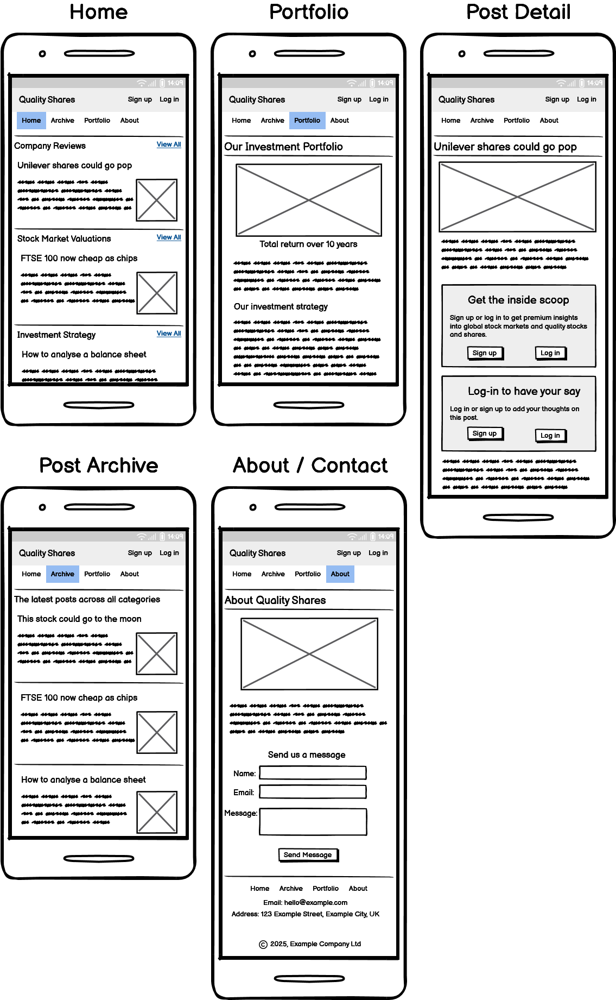
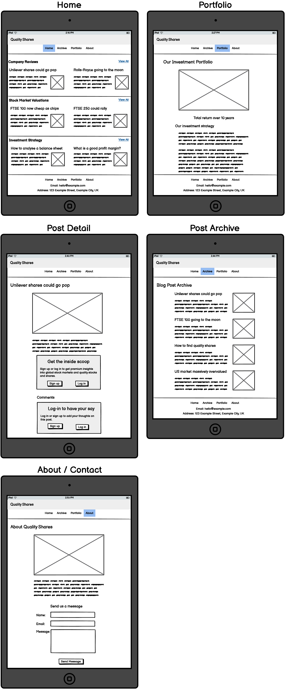
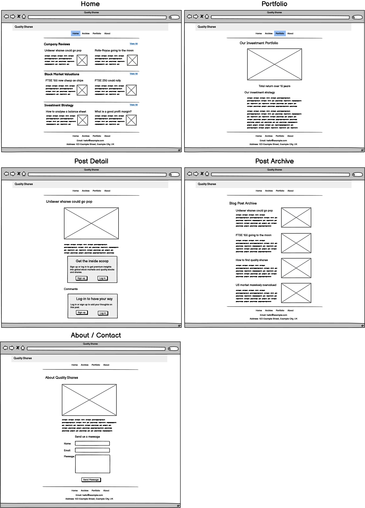

# Quality Shares

- [Live website on Heroku](https://quality-shares-3f67cc1f7e60.herokuapp.com/) 

Quality Shares is an informative and educational website for "quality investors"; in other words, investors seeking high-quality income and growth stocks.

I built the site for Jim Smith, a (fictional) financial analyst with 20 years’ experience. 

Jim was looking for a challenge and wanted to start his own business to leverage his extensive knowledge as an investor and analyst. He likes writing, so he wanted to launch a paid blog/newsletter business.

Jim already has a Substack where he publishes free weekly articles to build up his audience. He wanted to move from Substack to a bespoke website to give him (a) more control over the platform’s structure, and (b) more flexibility with potential future product offerings, such as books, courses, coaching, etc.

[IMAGE SHOWING THE SITE'S RESPONSIVENESS]

## Table of Contents

- [User Experience Design](#user-experience-design)
- [Technologies Used](#technologies-used)
- [Data Model](#data-model)
- [Features](#features)
- [Project Management](#project-management)
- [Testing](#testing)
- [Deployment](#deployment)
- [Credits](#credits)

## User Experience Design

I designed the site using the "five planes" UX design process.

### Strategy Plane

#### Product Owner Goals

- Primary goal:
  - To give Jim a bespoke, flexible platform that will help him grow his business.
- Supporting goals:
  - To raise awareness of Jim's business, so that more users enter the top of the funnel.
  - To build trust with users, so they're more likely to buy products (paid newsletters, e-books, etc.) from Jim in the future.
  - To publish free content for its SEO value and to nurture users with educational and informational content.
  - To make it easy for users to sign up for premium content.
  - To make it easy for users to subscribe to email newsletters, so we remain top of mind with leads.

#### User goals

- Primary goal:
  - To improve their investment returns.
- Supporting goals:
  - To learn more about investing and become a better investor.
  - To have access to information about companies, stock prices and stock markets that will help them make better-informed investing decisions.
  - To discuss investing with like-minded investors.

### Scope Plane

I created user stories to define the scope of the project. The stories are listed below, grouped into the sprints they were implemented in:

#### Sprint 1: Goal - To deploy the first version of the site, with Blog Post editing and a Portfolio page.

- As an Admin, I can create, update and delete blog posts, so I can attract new Users and nurture them with regular new content. (must-have)
- As an Admin, I can create, update and delete content about our investment performance, so Users can see how well our expertise has performed in practice. (should-have)
- As a User, I can see the author’s investment performance, so I can decide if they know what they’re talking about. (should-have)
- As a User, I can see a website that looks good and works well, with an understated professional design, so I’m not put off by something that looks overly flashy and gimmicky. (must-have)
- As a User, I can see the company's contact details, so I can use email, phone or social media to have a private conversation with someone at the company to ask them questions. (must-have)

#### Sprint 2: Goal - Add the Homepage and Blog Archive page.

- As an Admin, I can categorise articles, so Users can more quickly find the type of content they’re looking for. (could-have)
- As a User, I can see blog posts for different topic categories (e.g. market valuations, company reviews, investing strategies), so I can easily find the type of content I want to read. (could-have)
- As an Admin, I can authorise, edit or delete user-generated blog comments, to block or remove inappropriate content. (must-have)
- As a User, I can find and read useful information about relevant investments and investing, so I can become a better investor and discover worthwhile investments. (must-have)

#### Sprint 4: Goal - Add user comments, premium content and an about page.

- As a User, I can converse with other users and the admin, so I can have engaging conversations with like-minded people. (must-have)
- As an Admin, I can create free and premium content, and control access accordingly. (could-have)
- As a User, I can easily sign up to read premium content, so I can further benefit from the author’s knowledge and experience. (could-have)
- As an Admin, I can create, update and delete "about" content, so Users know something about the people behind the articles they’re reading. (should-have)
- As a User, I can read about the people behind the website, so I can decide if they’re trustworthy. (should-have)
- As a User, if there is an error loading a page then I'm shown a helpful error page in the style of the overall website, so I'm not put off by badly styled error pages. (must-have)

### Structure Plane

To fulfil the user stories, I designed the site to have the following structural elements:

Note that some of these structural elements did not make it into the deployed website, due to time constraints and/or user feedback.

### Skeleton Plane

I used wireframes to add detail to the structural elements above. These wireframes were not intended to be used as blueprints, so there are some minor differences between them and the deployed site, mostly due to user feedback.

#### Mobile Wireframes

#### Tablet Wireframes

#### Desktop Wireframes

### Surface Plane

#### Colour palette

The colour palette was inspired by the colours used by [Hargreaves Lansdown](https://www.hl.co.uk/).

- #ABC123 - EXAMPLE COLOUR!

#### Custom fonts

The site uses two custom fonts from Google Fonts.

- XXX: EXAMPLE FONT
- ZZZ: EXAMPLE FONT

#### Content

All model-based content (e.g. blog posts, portfolio page content) was generated using [Microsoft Co-Pilot](https://copilot.microsoft.com/).

## Technologies Used

### Languages

- HTML
- CSS
- [Python](https://www.python.org/)

### Installed Python Libraries

- [A LIBRARY]
- (plus required dependencies of the above libraries)

### Other Technologies
- [PostgreSQL]

## Features

### Implemented Features

MUCH MORE TO ADD...