# Quality Shares - Automated Testing

The Django project has three apps (about, blog and portfolio), each of which has a `test_views.py` file containing unit tests.

## About App Tests

|Test Class|Test Method|Status|
|---|---|---|
|TestAboutView|test_about_page|Pass|

## Blog App Tests

|Test Class|Test Method|Status|
|---|---|---|
|TestBlogViews|test_post_list_view|Pass|
|TestBlogViews|test_post_detail_view|Pass|
|TestBlogViews|test_category_list_view|Pass|
|TestBlogViews|test_new_comment_submission|Pass|

Tests for editing and deleting comments would have been ideal, but these were not a required part of the project and were deferred due to time constraints.

## Portfolio App Tests

|Test Class|Test Method|Status|
|---|---|---|
|TestPortfolioView|test_portfolio_page|Pass|

# Quality Shares - Manual Testing

## Front-End Functionality

### Header Section

|Feature|Expect|Action|Result|Image|
|---|---|---|---|---|
|Site logo|When clicked, the user is taken to the homepage|Clicked the logo|As expected|None|
|Site title|When clicked, the user is taken to the homepage|Clicked the title|As expected|None|
|Sign-up button|When the user is not logged in, a sign-up button is visible|Viewed header when logged out|As expected|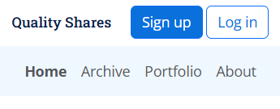|
|Sign-up button|When clicked, the user is taken to the sign-up page|Clicked sign-up button|As expected|None|
|Log-in button|When the user is not logged in, a log-in button is visible|Viewed header when logged out|As expected||
|Log-in button|When clicked, the user is taken to the log-in page|Clicked log-in button|As expected|None|
|Log-out button|When the user is logged in, a log-out button is visible|Viewed header when logged in|As expected|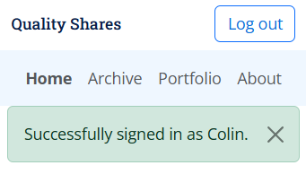|
|Log-out button|When clicked, the user is taken to the log-out page|Clicked log-in button|As expected|None|

### Footer Section

|Feature|Expect|Action|Result|Image|
|---|---|---|---|---|
|Social media links|When clicked, a new tab opens showing the relevant social media platform|Clicked each link|As expected|None|

### Posts by Category Section

|Feature|Expect|Action|Result|Image|
|---|---|---|---|---|
|Post title link|When clicked, the user is taken to the Post Detail page for that post|Clicked several links|As expected|None|

### Post Detail - Content Section

The Post Detail main content section has no interactive functionality to test.

### Post Detail - Premium Content Section

|Feature|Expect|Action|Result|Image|
|---|---|---|---|---|
|No premium content|If a post has no premium content, no sign-up/log-in panel is shown|Viewed a post with no premium content|The sign-up/log-in panel wasn't shown|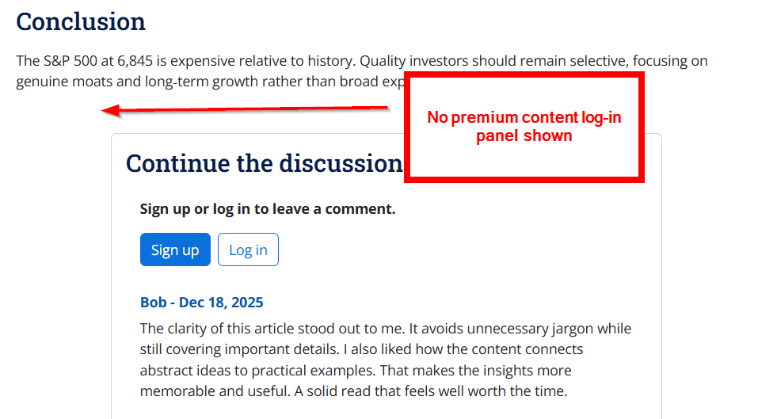|
|Premium content panel|When the user is logged out and the post contains premium content, the user is shown a sign-up/log-in panel|Viewed a post with premium content as a logged-out user|As expected||
|Sign-up button|When clicked, the user is taken to the sign-up page|Clicked sign-up button|As expected|None|
|Log-in button|When clicked, the user is taken to the log-in page|Clicked log-in button|As expected|None|
|Premium content|When the user is logged in and the post contains premium content, the user is shown the premium content|Viewed a post with premium content as a logged-in user|As expected||

### Post Detail - Comments Section

|Feature|Expect|Action|Result|Image|
|---|---|---|---|---|
|Sign-up or log-in request|When the user is logged out, the comments section asks the user to sign-up or log-in |Viewed the comments section of a post as a logged-out user|As expected||
|Sign-up button|When clicked, the user is taken to the sign-up page|Clicked sign-up button|As expected|None|
|Log-in button|When clicked, the user is taken to the log-in page|Clicked log-in button|As expected|None|
|Hide unapproved comments|When the user is logged out, unapproved comments are not visible|As a logged out user, viewed the comments section of a post with unapproved comments|As expected||
|Show approved comments|When the user is logged out, approved comments are visible|As a logged out user, viewed the comments section of a post with approved comments|As expected||
|Comment form|When the user is logged in, the sign-up/log-in request is replaced with a comment form|Viewed the comments section as a logged-in user|As expected||
|Empty comment validation|If the user submits an empty comment form, a validation message is shown and the form does not submit|Tried to submit an empty comment form|As expected|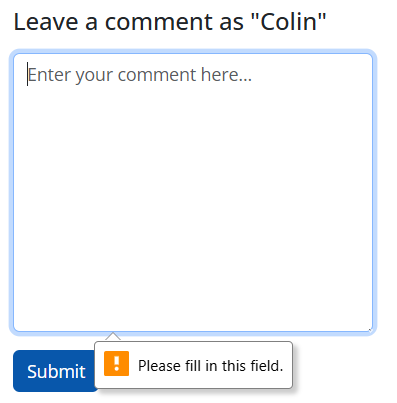|
|Create comment|When the user submits the comment form with content, an unapproved comment is created and shown below the form|Submitted the comment form with a new comment|As expected|*Before submitting*  *After submitting* |
|Create comment message|When the user submits the comment form, an "awaiting approval" message is shown|Submitted the comment form|As expected||
|Unapproved comments|When the user is logged in, they can see their unapproved comments with Edit and Delete buttons|Viewed unapproved comments as the logged-in comment author|As expected||
|Editable comments|When the user is logged in, all of their comments have Edit and Delete buttons|Viewed comments as the logged-in comment author|As expected||
|Edit comment|When the edit button is clicked, the comment text is copied into the comment form and the comment form's button text changes to "Update"|Clicked the edit button for an unapproved comment|As expected||
|Update approved comment|When the comment form is submitted to update an approved comment, the comment text is updated and its status is set to unapproved|Updated an approved comment via the comment form|As expected||
|Edit comment message|When a comment is edited, an "awaiting approval" message is shown|Edited a comment|As expected||
|Delete comment|When the delete button is clicked, a confirmation modal is shown|Clicked the delete button|As expected||
|Delete comment|When the Confirm Delete button is clicked, the comment is deleted|Clicked the Confirm Delete button|As expected||
|Deleted comment message|When the Confirm Delete button is clicked, a "comment deleted" message is shown|Clicked the Confirm Delete button|As expected||

### Post List Section

|Feature|Expect|Action|Result|Image|
|---|---|---|---|---|
|Post title link|When clicked, the user is taken to the Post Detail page for that post|Clicked several links|As expected|None|

### Portfolio and About Sections

The Portfolio and About sections have no interactive functionality to test.

### Sign-up, Log-in and Log-out Sections

|Feature|Expect|Action|Result|Image|
|---|---|---|---|---|
|Sign-up validation|When the sign-up form is submitted with missing required fields, validation messages are shown and the form is not submitted|Tried submitting the sign-up form with various required fields missing|As expected|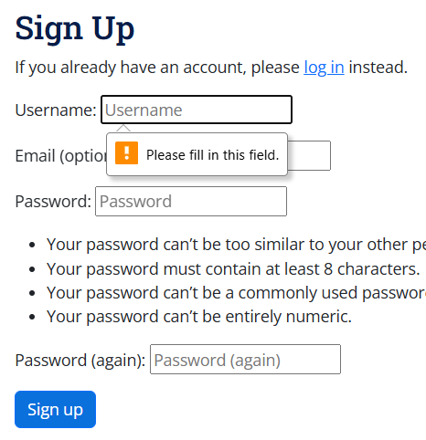|
|Sign-up message|After submitting the sign-up form, a new user profile is created, the user is logged in and a confirmation message is shown|Signed up as a new user|As expected||
|Log-in validation|When the log-in form is submitted with missing required fields, validation messages are shown and the form is not submitted|Tried submitting the log-in form with various required fields missing|As expected|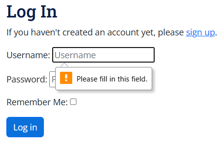|
|Logged-in message|After submitting the log-in form, the user is logged in and a confirmation message is shown|Logged in|As expected||
|Log-out|When a logged-in user clicks the log-out button, the user is logged out and a confirmation message is shown|Clicked the log-out button as a logged-in user|As expected|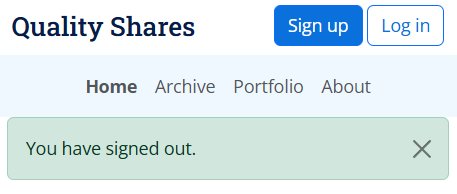|

### 404 and 500 Error Sections

|Feature|Expect|Action|Result|Image|
|---|---|---|---|---|
|404 error page|When an invalid path is entered, a helpful error page is shown|Entered an invalid path|As expected|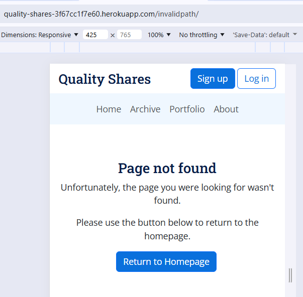|
|404 homepage button|When the "homepage" button is clicked, the user is sent to the homepage|Clicked the "homepage" button|As expected|None|
|500 error page|When an internal server error occurs, a helpful error page is shown|Simulated an internal server error (in the development environment, as this is not appropriate for production)|As expected||
|500 homepage button|When the "homepage" button is clicked, the user is sent to the homepage|Clicked the "homepage" button|As expected|None|

## Admin Site Functionality

The admin site is a built-in part of Django, so I didn't test it as thoroughly as the parts I coded. However, I did run some basic tests to ensure the required functionality was there.

### About Admin

|Feature|Expect|Action|Result|Image|
|---|---|---|---|---|
|About fields|The About admin area has the correct fields|Checked the About fields|As expected||
|About image|Local images can be uploaded, stored in Cloudinary and accessed from the front-end|Uploaded a local image, saved the About record and checked the About page|As expected|See above image|
|About front-end|The About content and image are visible and correctly formatted on the front-end|Viewed the About page|As expected||

### Portfolio Admin

|Feature|Expect|Action|Result|Image|
|---|---|---|---|---|
|Portfolio fields|The Portfolio admin area has the correct fields|Checked the Portfolio fields|As expected||
|Portfolio image|Local images can be uploaded, stored in Cloudinary and accessed from the front-end|Uploaded a local image, saved the Portfolio record and checked the Portfolio page|As expected|See above image|
|Portfolio front-end|The Portfolio content and image are visible and correctly formatted on the front-end|Viewed the Portfolio page|As expected||

### Post Admin

|Feature|Expect|Action|Result|Image|
|---|---|---|---|---|
|Post fields|The Post admin area has the correct fields|Checked the Post fields|As expected||
|Post image|Local images can be uploaded, stored in Cloudinary and accessed from the front-end|Uploaded a local image, saved the Post record and checked the Post Detail page|As expected|See above image|
|Post front-end|Post content and image are visible and correctly formatted on the front-end|Viewed the Post Detail page|As expected||

### Comment Admin

|Feature|Expect|Action|Result|Image|
|---|---|---|---|---|
|Comment fields|The comment admin area has the correct fields|Checked the comment fields|As expected||
|Comment editing|Comments can be CRUDed on the back-end|CRUDed a comment on the back-end|As expected||

### Category Admin

|Feature|Expect|Action|Result|Image|
|---|---|---|---|---|
|Category fields|The Category admin area has the correct fields|Checked the Category fields|As expected||
|Category editing|Categories can be CRUDed on the back-end|CRUDed a category on the back-end|As expected||
|Category front-end|Changes to categories are visible on the front end|Updated a category and checked the front-end|As expected||

## Acceptance Tests

Each user story has one or more acceptance criteria that has to be met before the story can be considered done. You can read the acceptance criteria for each user story in the [GitHub Project](https://github.com/users/John-Kingham/projects/14).

All acceptance criteria have been met for implemented user stories.

## Colour Contrast

I tested colour contrasts using [colourcontrast.cc](https://colourcontrast.cc/) because the [WebAIM](https://webaim.org/) site was down.

### White + Primary

This combination is used across the site for headings and passes all tests.

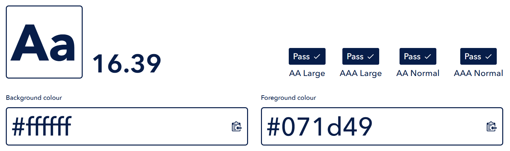

### White + Secondary

This combination is mostly used for buttons and passes all tests at the minimum AA standard.

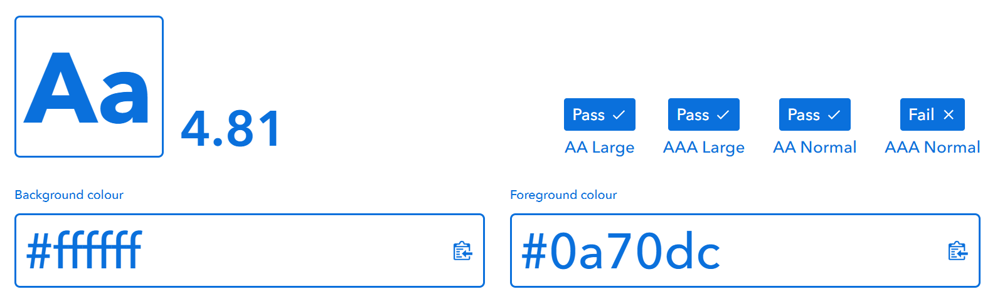

### Tertiary + Primary

This combination is used for the header navigation bar, footer text, outline buttons in the hover state and other areas where a light background colour is used. It passes all tests.

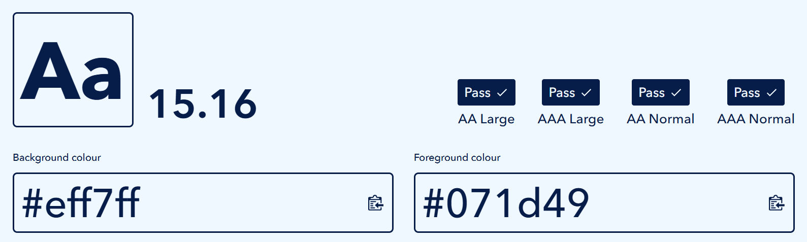

### Tertiary Highlight + Primary

This combination is used in the header navigation bar on hover. It passes all tests.

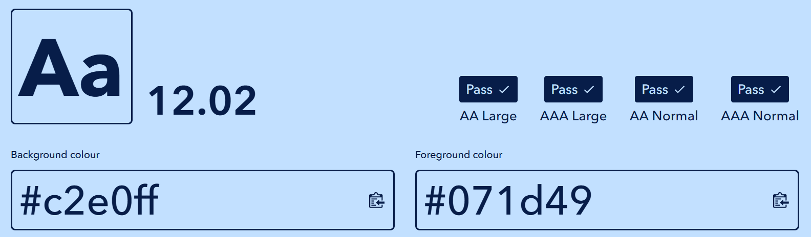

### Bootstrap Light + Secondary

This combination is used in the premium content info panel and for unapproved comments. It passes all tests at the minimum AA standard.

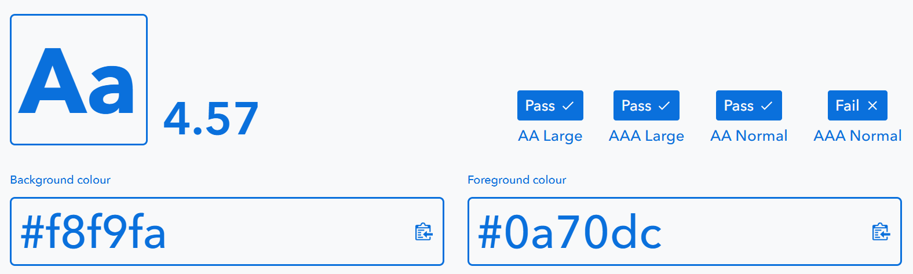

### Bootstrap Light + Bootstrap Body Color

This combination is used for unapproved comments. It passes all tests.

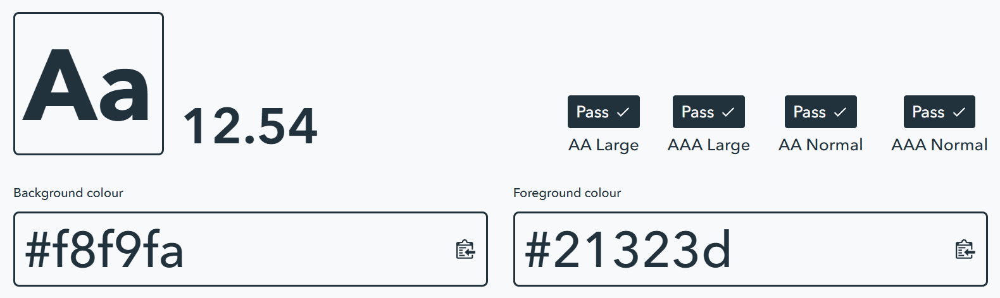

### Bootstrap Light + Bootstrap Danger

This combination is used for unapproved comments. It only passes the AA Large test, but as this combination is only used with bold text, this is acceptable.

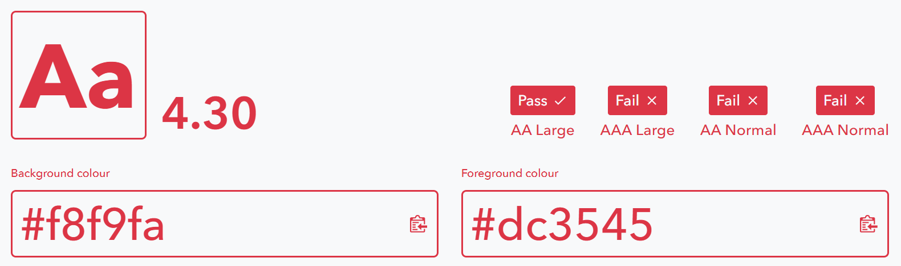

## Responsiveness

|Section|Mobile Responsive?|Tablet Responsive?|Desktop Responsive?|
|---|---|---|---|
|Header Nav|Yes|Yes|Yes|
|Footer Contact Details|Yes|Yes|Yes|
|Posts by Category|Yes|Yes|Yes|
|Posts Archive|Yes|Yes|Yes|
|Post Detail|Yes|Yes|Yes|
|Premium Content|Yes|Yes|Yes|
|Comments|Yes|Yes|Yes|
|Portfolio|Yes|Yes|Yes|
|About|Yes|Yes|Yes|

### Responsiveness Screenshots

Home - Mobile

Home - Tablet

Home - Desktop

 

Post Detail - Mobile

Post Detail - Tablet

Post Detail - Desktop

 

Archive - Mobile

Archive - Tablet

Archive - Desktop

 

Portfolio - Mobile

Portfolio - Tablet

Portfolio - Desktop

 

About - Mobile

About - Tablet

About - Desktop

## Browsers

The site's functionality and responsiveness were tested on Chrome, Edge and Firefox, as these are some of the most popular browsers.

|Test|Chrome|Edge|Firefox|
|---|---|---|---|
|Home as expected?|Yes|Yes|Yes|
|Post Detail as expected?|Yes|Yes|Yes|
|Archive as expected?|Yes|Yes|Yes|
|Portfolio as expected?|Yes|Yes|Yes|
|About as expected?|Yes|Yes|Yes|

### Browser Screenshots

All of the screenshots in the sections above were taken on Chrome. Rather than include every screenshot for every browser, here are a few screenshots from Edge and Firefox showing similar results to Chrome:

Home - Desktop - Firefox

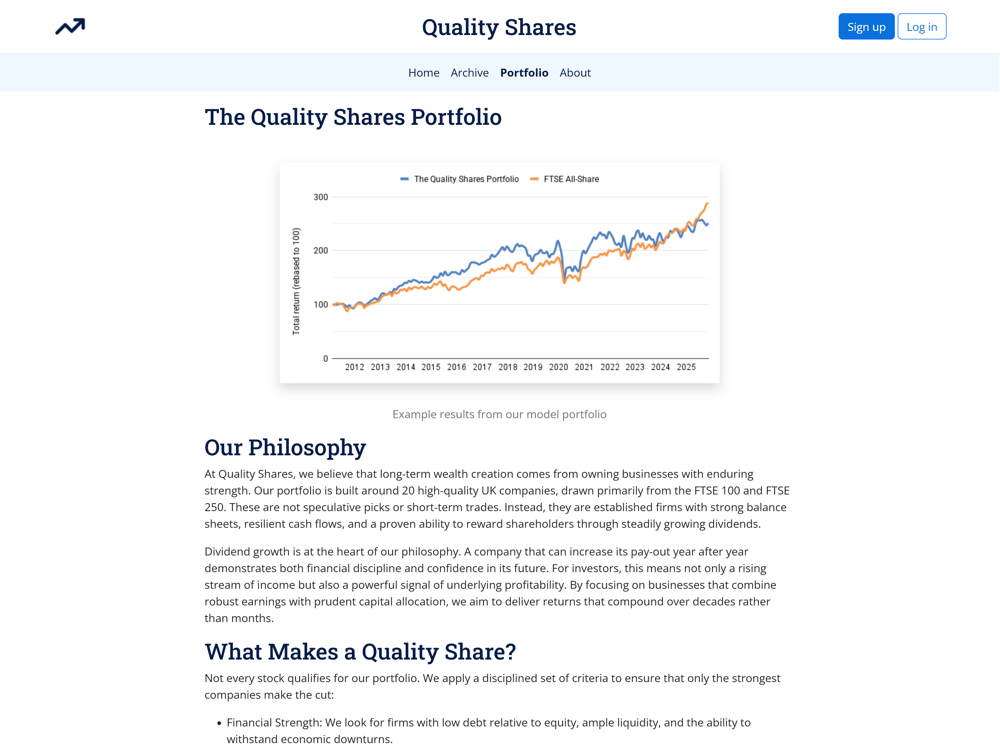

Archive - Tablet - Firefox

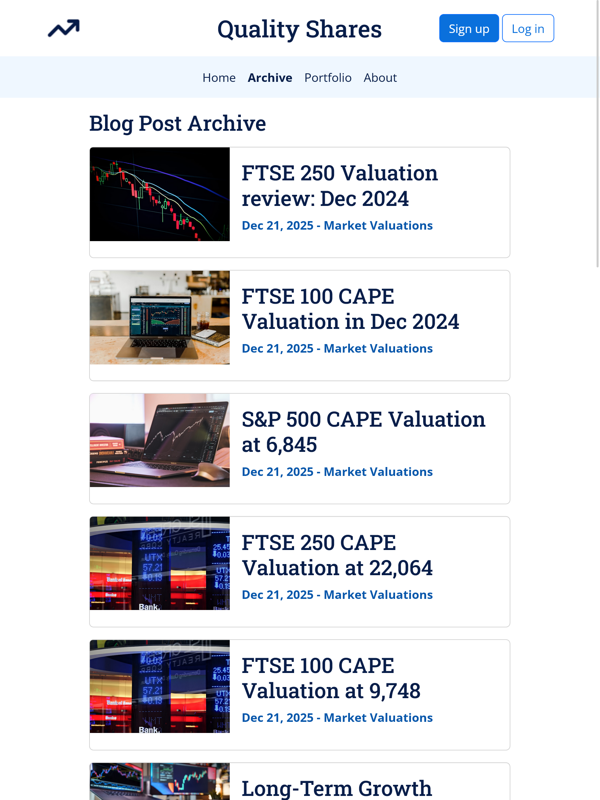

Post Detail - Mobile - Edge

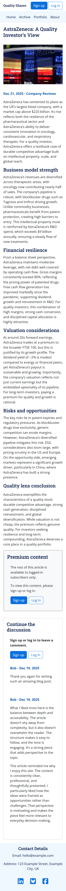

## Code Validation

### HTML Validation

HTML was validated using the [W3C Markup Validation Service](https://validator.w3.org/).

#### Home HTML Validation

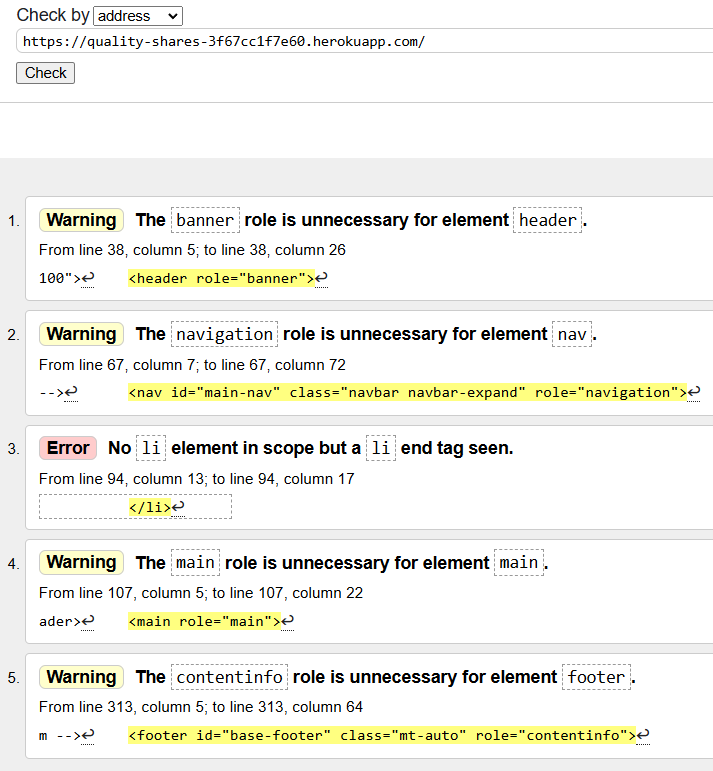

There were four errors relating to unnecessary ARIA roles. I fixed these warnings by removing the offending roles.

There was one error relating to an unnecessary closing `li` tag. I fixed this error by removing the offending tag.

I revalidated the page and there were no errors or warnings.

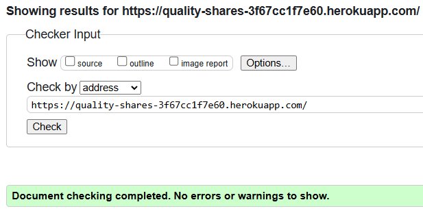

#### Post Detail HTML Validation

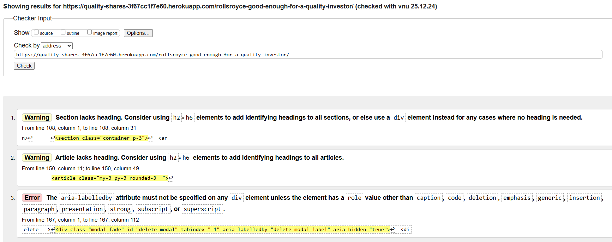

There was one warning about a section without a heading. To fix this, I changed the section to a div.

There was one warning about an article without a heading. This was a comment. To fix this, I changed the comment meta-info into a heading.

There was one error about the use of aria-labelledby on a plain div. I fixed this by giving the div a role of `dialog`.

I revalidated the page and there were no errors or warnings.

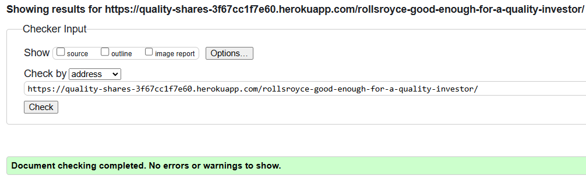

#### Archive HTML Validation

There were two errors relating to an unclosed section element. The closing element was outside the `` statement, so I moved it inside.

I revalidated the page and there were no errors or warnings.

#### Portfolio HTML Validation

There was one warning about a missing section heading. I fixed this by changing the section to a div. I thought the about page would have the same defect, which it did, so I applied the same fix to the about page.

I revalidated the page and there were no errors or warnings.

#### About HTML Validation

There were no errors or warnings.

### CSS Validation

CSS validation was carried out using the [W3C CSS Validation Service](https://jigsaw.w3.org/css-validator/).

#### style.css Validation

There was one error relating to an empty `var()` function. To fix this, I removed the empty call and its CSS selector. 

There were also three warnings about CSS variables not being statically checked. These warnings are unavoidable and do not need to be fixed.

I revalidated the CSS and there were no errors.

### JavaScript Validation

JavaScript validation was carried out using [JSHint](https://jshint.com/).

#### comments.js

There was one warning about `bootstrap` being an undefined variable. This is expected and is okay as the bootstrap JS is loaded by the HTML file before this custom JS file.

### Python Validation

Python code was validated using the [Code Institute Python Linter](https://pep8ci.herokuapp.com/).

#### about/admin.py

#### about/models.py

#### about/test_views.py

#### about/urls.py

#### about/views.py

#### blog/admin.py

#### blog/forms.py

#### blog/models.py

#### blog/test_views.py

#### blog/urls.py

#### blog/views.py

#### portfolio/admin.py

#### portfolio/models.py

#### portfolio/test_views.py

#### portfolio/urls.py

#### portfolio/views.py

#### quality_shares/settings.py

#### quality_shares/urls.py

#### quality_shares/views.py

## Lighthouse

|Path|Device|Result|
|---|---|---|
|/|Mobile|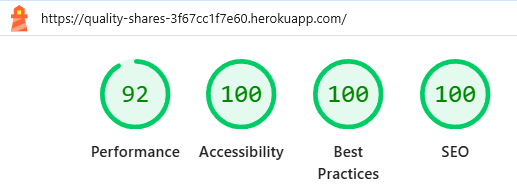|
|/|Desktop|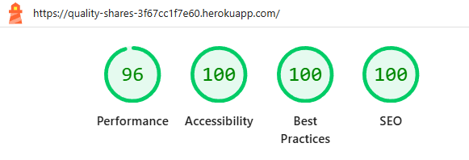|
|archive/|Mobile|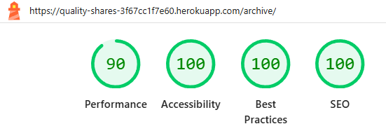|
|archive/|Desktop|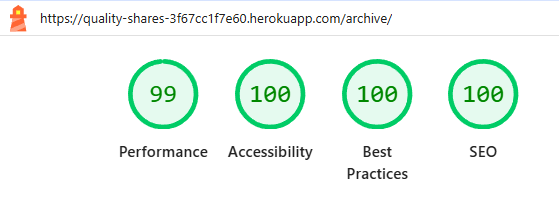|
|portfolio/|Mobile|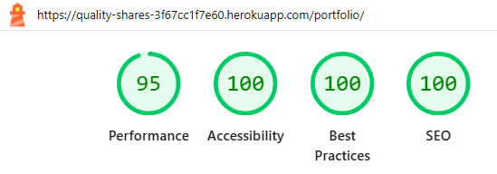|
|portfolio/|Desktop|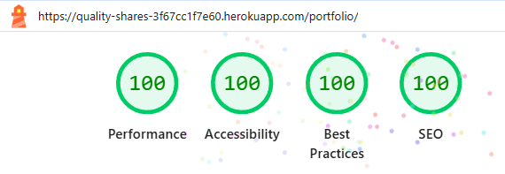|
|about/|Mobile|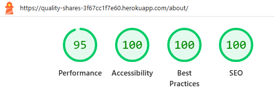|
|about/|Desktop||
|post-slug/|Mobile|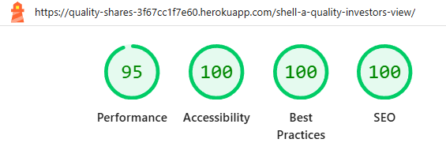|
|post-slug/|Desktop|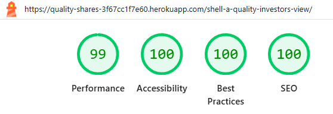|

## Bugs

### Fixed Bugs

There were many bugs created and squashed throughout the construction phase. Many of these were fixed before the buggy code was commited, and therefore didn't make it into the commit history. Other bugs were fixed after the defect had been committed, so a separate fix commit had to be created. 

Bug fix commits have a commit message prefixed with `fix`, so they're easy to identify within the commit history and are listed here for reference:

- fix: add missing social media links
- fix: only show published posts
- fix: add homepage links to site logo and title
- fix: restore portfolio image caption
- fix: fix errors with comment html structure
- fix: make site title visible on mobiles
- fix: add padding to unapproved comments
- fix: fix comment form margin
- fix: fix overlapping unapproved comments
- fix: remove unnecessary HTML roles and tags
- fix: fix post detail HTML validation issues
- fix: fix post archive HTML validation issues
- fix: fix portfolio and about HTML issues
- fix: remove empty CSS var() call
- fix: don't always show the premium content panel

### Unfixed Bugs

There are no unfixed bugs that I am aware of. Having said that, even after thorough testing I cannot completely rule out the possibility of some hidden bugs.